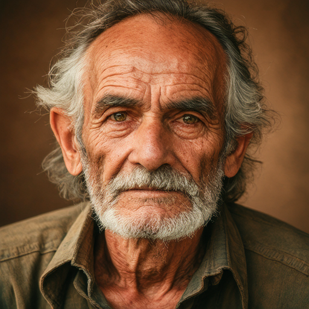
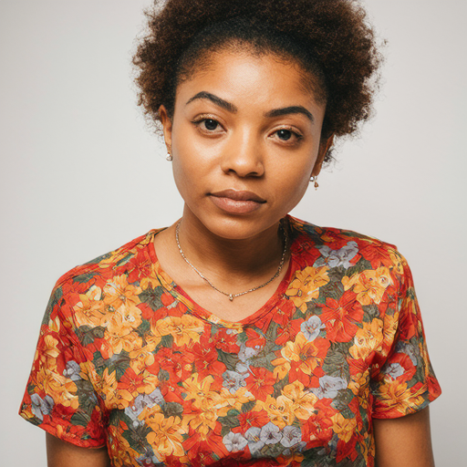

<h1 align="center"> When Preference Labels Fall Short — Aligning Diffusion Models from Real Data </h1>

<div align="center">
  <a href='TODO'></a> &nbsp;
  <a href='TODO'></a> &nbsp;
  <a href='TODO'></a> &nbsp;
  <a href='TODO'></a> &nbsp;
  <a href='TODO'></a>
</div>

<p align="center"><em>Accepted at ICML 2026. Links above are placeholders — TODO before public release.</em></p>

## Abstract

Preference alignment aims to guide generative models by learning from comparisons between preferred and non-preferred samples. In practice, most existing approaches rely on preference pairs constructed from model-generated images. Such supervision is inherently relative and can be ambiguous when both samples exhibit artifacts or limited visual quality, making it difficult to infer what constitutes a truly desirable output. In this work, we investigate whether real data can serve as an alternative source of supervision for preference alignment. We adopt a data-centric perspective and study a curation strategy that treats real images as reference points and constructs preference signals by contrasting them with generated or perturbed samples, without requiring manually annotated preference pairs. Through empirical analysis, we show that real-data-based supervision provides effective guidance for aligning diffusion models and achieves performance comparable to existing preference-based methods. Our results suggest that real data offers a practical and complementary source of supervision for preference alignment and highlight directions of label-efficient alignment strategies.

## Gallery

<p align="center">
  
  
  
  
</p>
<p align="center">
  
  
  
  
</p>

## Repository layout

Only the directories listed below are part of RealAlign itself. `notebook/` holds scratch analyses unrelated to the pipeline.

| Path | What lives here |
|---|---|
| [`data_curation/`](data_curation/) | Builds (real, fake) preference pairs from HPDv3 / Pick-a-Pic v2 / Civitai-top. Four stages: `extract → construct_pairs → score → filter`. Outputs the CSV consumed by training. |
| [`training_sd15/`](training_sd15/) | RealAlign **SD-1.5** two-stage trainers. `stage1_diffusion_dro/train-irl.py` (Stage 1) and `stage2_dpo/train-lora_init.py` (Stage 2, LoRA-init from Stage 1). |
| [`training_sd35m/scripts/`](training_sd35m/scripts/) | RealAlign **SD-3.5-M** two-stage trainers: `train-sd-3-5-medium-irl.py` (Stage 1) and `train-sd-3-5-medium-dpo.py` (Stage 2). Live here because they `import flow_grpo.*` and depend on the local `diffusers_patch/` SDE samplers. |
| [`training_sd35m/evaluation/`](training_sd35m/evaluation/) | SD-3.5-M eval harness: `sd-3-5-medium/{generate_image.py, calculate_score.py}`. Reads prompt lists from `training_sd35m/dataset/{pick_a_pic_v2, partiprompts, drawbench-unique}`. All six metrics (PickScore, ImageReward, Aesthetic, HPSv3, DeQA, UnifiedReward) go through `flow_grpo.rewards.multi_score`. |
| [`evaluate_metric/`](evaluate_metric/) | PickScore / HPSv3 / Aesthetic / CLIPScore / DeQA / VILA + vendored Clean-FID, CMMD, CPBD. |
| [`benchmark-evaluation/`](benchmark-evaluation/) | DPG-Bench evaluation scripts for SD-1.5 and SD-3.5-M. |

## 🚀 Quick start

### 1. Environment

Every shell script in this repo expects a single `alignprop` conda env
and begins with:

```bash
source /data3/chenweiyan/miniconda3/etc/profile.d/conda.sh
conda activate alignprop
export HF_ENDPOINT=https://hf-mirror.com   # huggingface mirror (dev cluster)
```

Replace the `conda.sh` path when porting to a new machine. The env pins `torch==2.6.0`, `diffusers==0.33.1`, `transformers==4.40.0`, `accelerate==1.4.0`, Python 3.10. See [`training_sd35m/setup.py`](training_sd35m/setup.py) for the full install (`cd training_sd35m && pip install -e .`).

### 2. Build training pairs

```bash
cd data_curation
# follow data_curation/README.md: extract → construct_pairs → score → filter
```

The pipeline outputs a CSV that both training stages consume as `csv_file_path` (SD-1.5) / `train_dataset` (SD-3.5-M). See [`data_curation/README.md`](data_curation/README.md).

### 3. Train

| Model | Stage 1 (Diffusion-DRO) | Stage 2 (Diffusion-DPO, LoRA-init) |
|---|---|---|
| **SD-1.5** | `bash training_sd15/stage1_diffusion_dro/train-irl.sh` | `bash training_sd15/stage2_dpo/lora_init.sh` |
| **SD-3.5-M** | `bash training_sd35m/scripts/single_node/inverse_reinforcement_learning.sh` | `bash training_sd35m/scripts/single_node/dpo.sh` |

Both stages read the same CSV. Stage 2 reads Stage 1's LoRA from `pretrained_lora_path` (SD-1.5) / `config.train.lora_path` (SD-3.5-M); edit the shell (SD-1.5) or `config/sd3_5_medium_dpo.py` (SD-3.5-M) to point at Stage 1's checkpoint before launching Stage 2.

Full hyperparameters, launchers, and config schema: [`training_sd15/README.md`](training_sd15/README.md).

### 4. Evaluate

DPG-Bench generation + evaluation scripts live in [`benchmark-evaluation/DPG-Bench/`](benchmark-evaluation/DPG-Bench/) (`DPG-Bench-script-sd-v1-5.sh`, `DPG-Bench-script-sd-3-5-medium.sh`). Reward-model and image-quality metrics live in [`evaluate_metric/`](evaluate_metric/) (`calculate_metric.py`, `evaluate_*.sh`).

## 🤗 Acknowledgement

Our codebase references the code from [Diffusion-DRO](https://github.com/basiclab/DiffusionDRO), [Diffusion-DPO](https://github.com/SalesforceAIResearch/DiffusionDPO), and [Flow-GRPO](https://github.com/yifan123/flow_grpo). We thank the authors for releasing their implementations.

## ⭐ Citation

> TODO: BibTeX will be added once the ICML 2026 proceedings entry is finalized.
